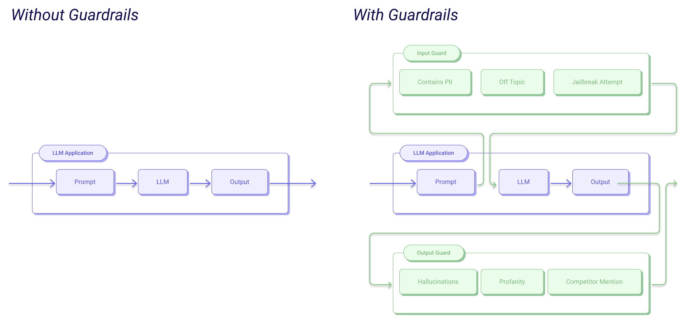
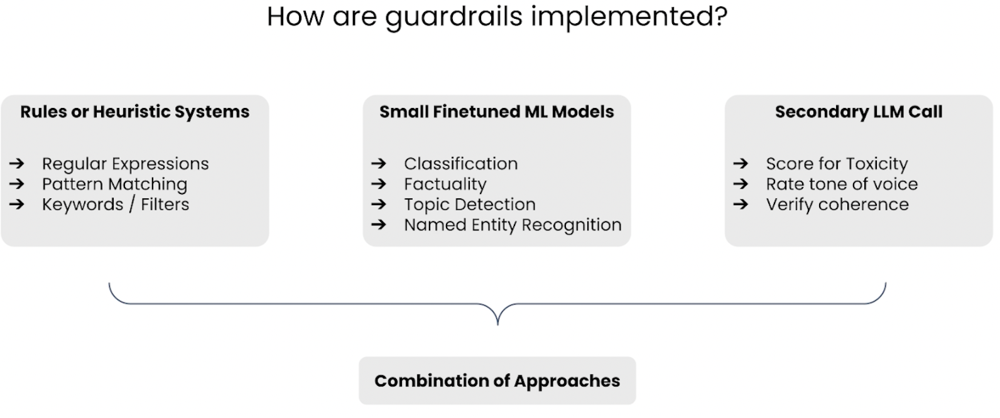
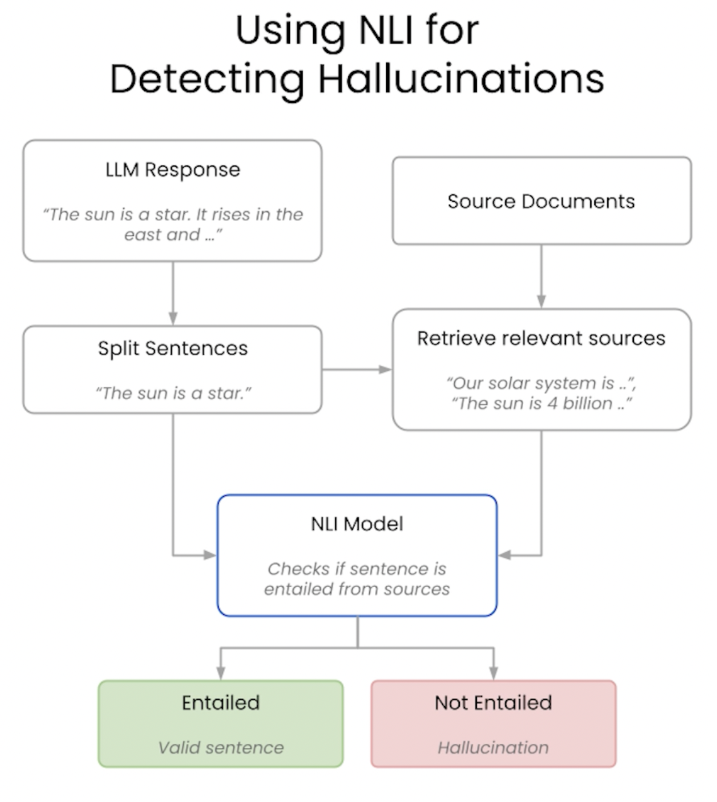
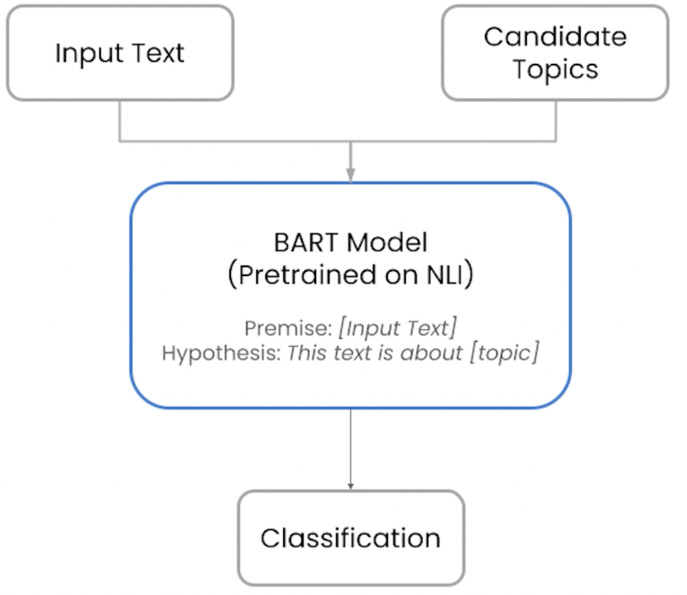
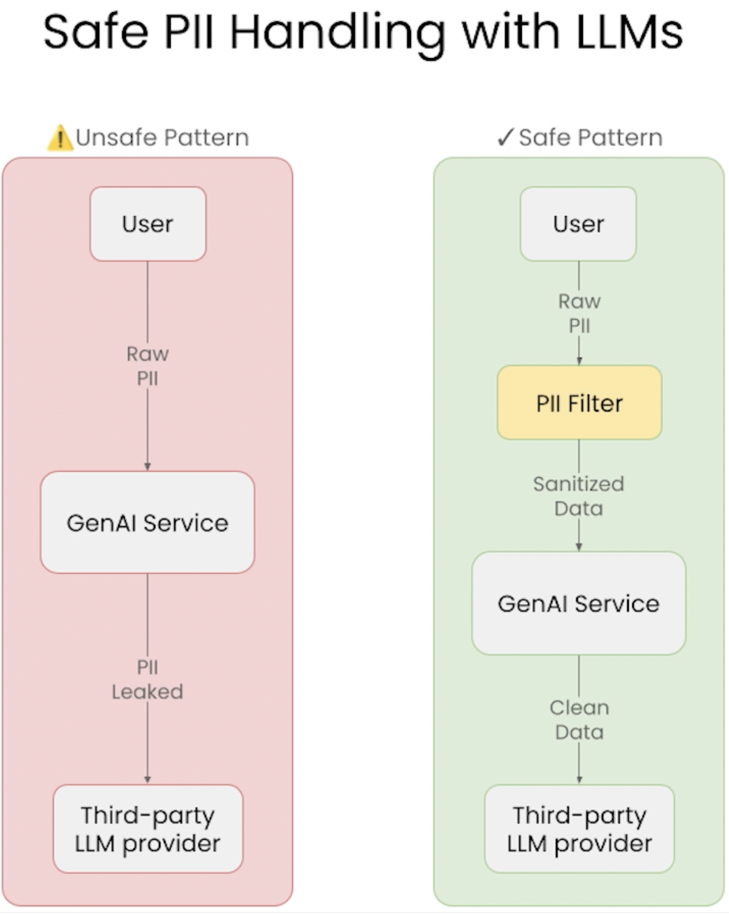

# **Safe and Reliable AI with Guardrails** [Notes]

## Introduction

- **Goal:** Improve reliability in generative AI applications.
- **Challenge:** The output of a Large Language Model (LLM) is hard to predict in advance.
    - Techniques such as context, prompt engineering, and fine-tuning can help orient the output, but they do not fully solve the problem of output variability.
    - RAG (Retrieval-Augmented Generation) and RLHF (Reinforcement Learning from Human Feedback) can be insufficient for many real-world production apps.
- **Guardrails:** Tools to check whether the input or output of an LLM conforms to a set of rules or guidelines.
    - Essential for moving beyond proof-of-concept to production.
    - AI reliability is a novel but key blocker for GenAI apps.
    - The **validator** is the key component: a function that checks user input or LLM output. Validators can use regex, NLP, or even other LLMs.
    - Guardrails can even help reduce LLM hallucination.

## Failure Modes in RAG Apps

- **Tension:** Models that do any task moderately well vs. models that do one task with very low failure rates.
- **Sources of Unreliable Behavior:**
    - **Model Limitations**
        - Insufficient capacity to answer certain questions.
        - Hallucinations, attempting graduate-level research problems.
    - **Unintended App Use**
        - Using the LLM app outside its intended scope (e.g., asking programming questions to a customer support chatbot).
    - **Information Leakage**
        - Mishandling sensitive data (e.g., leaking PII, missing sensitive sources as context).
    - **Reputational Damage**
        - Violating company rules, mentioning competitors inappropriately, or breaking regulations.
- **Mitigation Strategies:**
    - Better retrieval (RAG)
    - Improved prompting (Prompt Engineering)
    - Better models (Fine-tuning)
    - Stronger guardrails (AI Validation)

## What Are Guardrails?

- A **guardrail** is a secondary check or validation around the input or output of an LLM model.
- Validation ensures LLM behavior is valid—validity depends on the app’s context.
    - Examples: Proper output formatting, reducing hallucinations, preventing PII leakage or jailbreaking, etc.

### Benefits of Guardrails

- Explicitly verify that inviolable constraints (e.g., no PII leakage) are not violated.
- Measure the occurrence of undesirable behavior (e.g., LLM refusals, guardrail violations).
- Contain cascading errors in multi-agent architectures.

## Building a Guardrail

- **Validator:** Core logic that performs a desired check.
- **Guard:** App stack component that collects and orders multiple validators.
- **On-fail Action:** How to handle failures.
- **Guardrails Server:** Wraps the LLM API, surrounding it with input and output guards.

### Implementations

### Guardrails vs. Guards

Using a guardrail directly has the following key benefits:
- Quick implementation.
- Direct access to guardrail without abstraction.

Using a guard to implement a guardrail has the following key benefits:
- Run multiple guardrails on the same LLM request in parallel.
- Streaming support.

## Natural Language Inference (NLI)

- **Hallucinations:** Often due to lack of groundedness.
    - *Groundedness* means claims are explicitly supported by input context, not fabricated or recited from training data.
- **NLI Basis:**
    - **Premise:** Trusted content.
    - **Hypothesis:** Statement to evaluate.
    - **NLI Model:** Assesses whether the hypothesis and premise are in a relationship of entailment, contradiction, or neutrality.
- **Caveat:** A sentence can be factual (true) but ungrounded (no source backs the claim).

## Keeping a Chatbot On Topic

- Guardrails can enforce that the chatbot stays within its intended topic.
- Classification models (including LLMs) can be used for topic enforcement.
    - Note: LLMs are stochastic, so their classifications can vary, which is not ideal for consistent guardrail enforcement.

## Handling PII (Personally Identifiable Information)

- Use validators to check for PII in user input prompts to prevent passing sensitive data to third-party model providers.
- **Types of PII:**
    - **Direct Identifiers:** Name, email, national ID (e.g., cedula).
    - **Indirect Identifiers:** Location, demographics.
    - **Sensitive Data:** Health records, telco records.
- **Microsoft Presidio:** Tool for fast identification and anonymization of PII.

